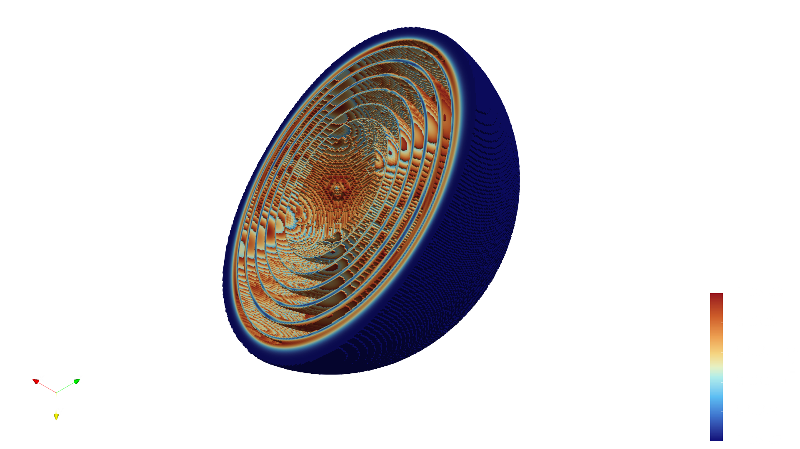

# Propagation of EM waves



This is a project realised for the _High Performance Scientific Computing_ class
at the University of Liège.

The goal is to simulate, using a finite difference scheme, the propagation of
electromagnetic waves.
The parallelization of the code and the its execution on a cluster will be studied.
At some point, a simulation will be run on a GPU.

## Building and running

The code can be compiled with the following commands :

```bash
BUILD="<target>" make -j$(nprocs)
```

where BUILD is one of folder target. Actually there is `reference`, `stability`, `openmp`, and `mpi`.
To build stability, an environment python with numpy and matplotlib is required.

It can be run with :

```bash
make run
```
